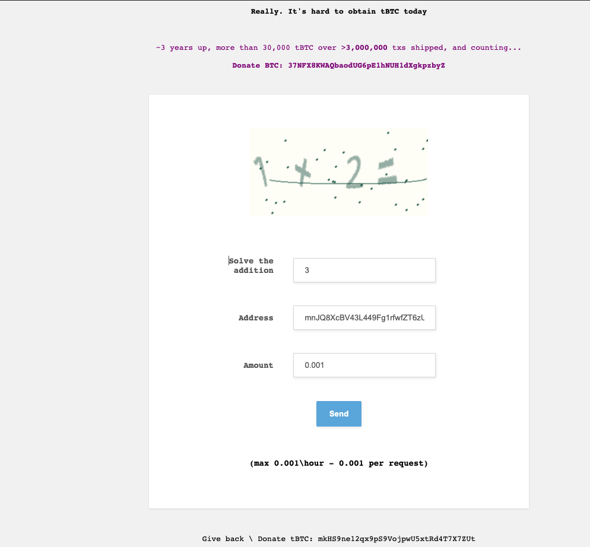
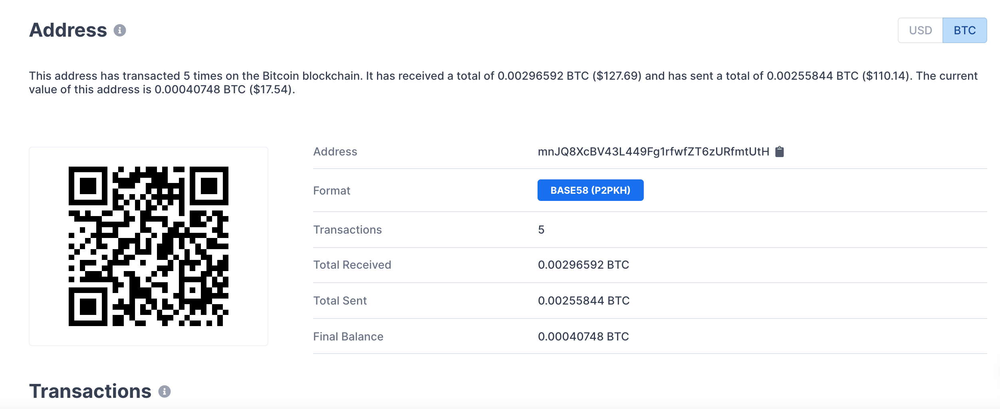
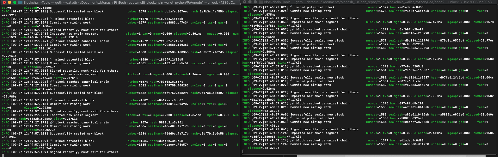
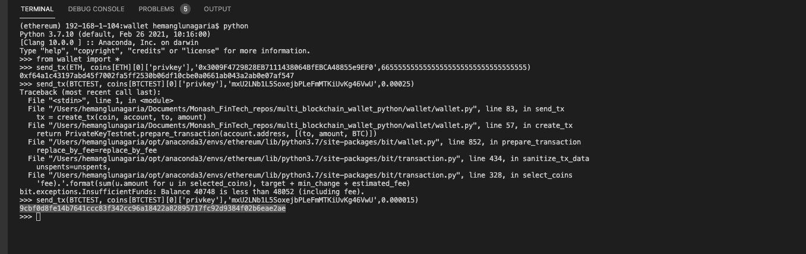
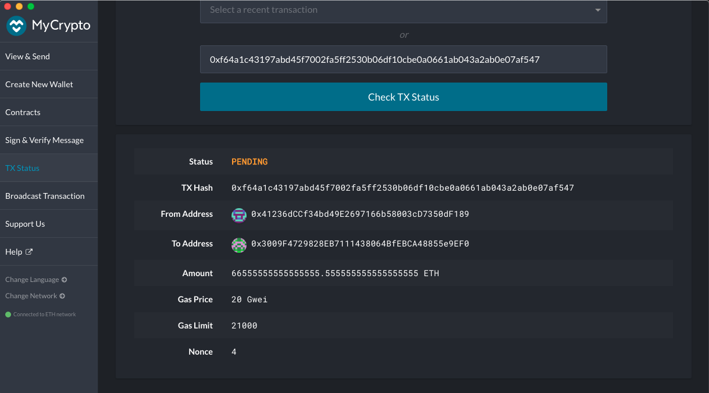
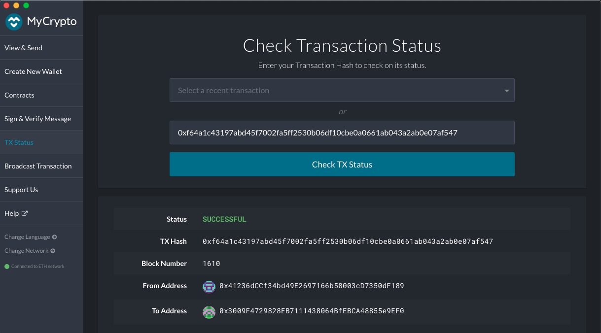
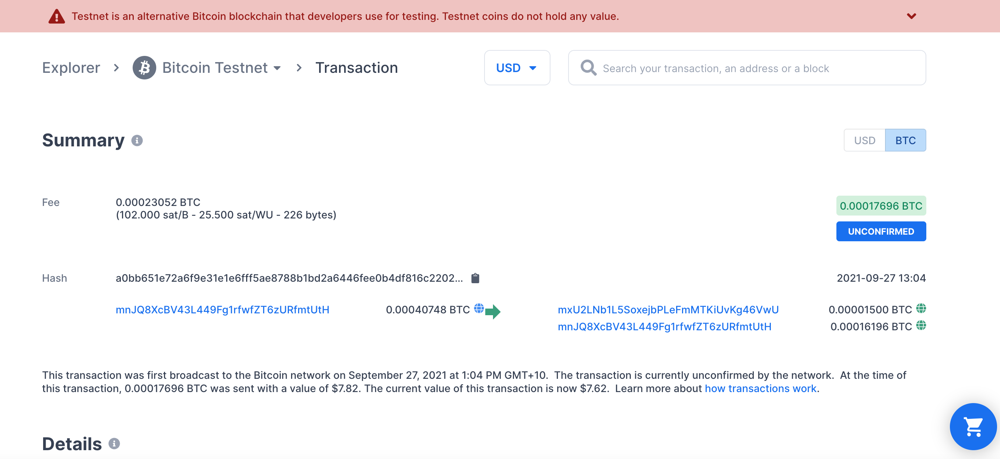

# Multi Blockchain Wallet with Python


## Description

This project aims to create wallet that can interact with blockchain networks. As PoC, this wallet will integrate with Ethereum and Bitcoin Test coins. It has the ability to send transactions from addresses that are generated using hd-wallet-derive command line tool.

## Wallet - Code Details

### Step 1

Fund the test accounts with some seed coins for testing.

* BTCTEST - Using a test faucet, fund the address as below.





* ETH - Run a local PoA blockchain

More details on how to run the PoA blockchain locally can be found in the README inside PoA directory.




### Step 2

Connect the python script to ETH Local blockchain via the below code

```
w3 = Web3(Web3.HTTPProvider("http://127.0.0.1:8545"))
w3.middleware_onion.inject(geth_poa_middleware, layer=0)
```
 bit library is used to connect to Bitcoin Test net.

 ### Step 3

 Run the python script in the Python shell









Logic to retrieve the latest transaction id needs bit more fine tuning and also need better error handling.
